# 企业校园信息发布系统

1.  **项目要求：**

> 创建一个Web工程，实现一个班级信息发布系统，在该Web程序中可实现：
>
> （1）具有用户登录功能，对用户身份的合法性进行验证；
>
> （2）浏览和发布班级通知信息，对合法用户提供留言功能；
>
> （3）能够通过学号或姓名对班级学生信息进行查询；
>
> （4）能够添加新的学生信息、修改和删除某学生信息；
>
> （5）用户界面要求交互功能良好。

1.  **开发平台及工具**

> 开发平台：Microsoft Windows 10 x64
>
> 工具：Java Development Kit 1.8.0\_92 x64
>
> Eclipse Mars 5.2
>
> Apache tomcat 8.0.33
>
> MySQL Server 5.7
>
> HTML5
>
> CSS3
>
> JavaScript
>
> Java

1.  **系统需求说明**

> 创建一个Web工程，实现一个班级信息发布系统，在该Web程序中可实现：
>
> （1）具有用户登录功能，对用户身份的合法性进行验证（完成）；
>
> （2）浏览和发布班级通知信息，对合法用户提供留言功能（完成）；
>
> （3）能够通过学号或姓名对班级学生信息进行查询（完成）；
>
> （4）能够添加新的学生信息、修改和删除某学生信息（完成）；
>
> （5）用户界面要求交互功能良好（良好）。

1.  **设计说明**

我的系统设计为C/S三层架构，分别是浏览器端、服务器端以及数据库端。三部分协同完成该Web工程要求。

网络拓扑图：

系统架构图：

Java类如下图：

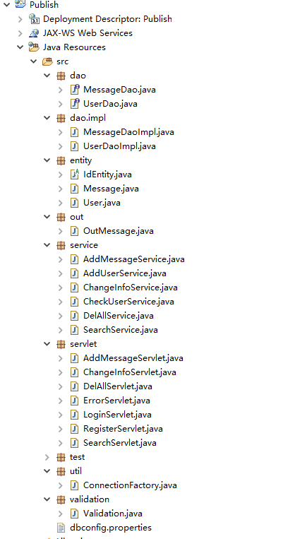

Jsp页面如下：

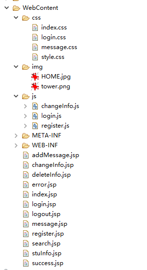

数据库设计：

ER图：

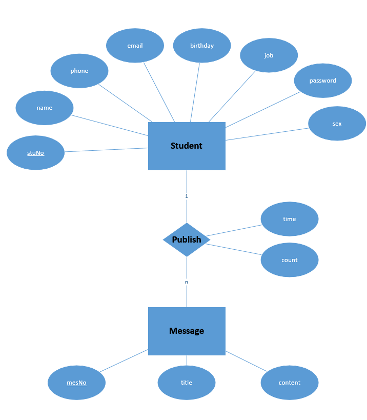

student表：

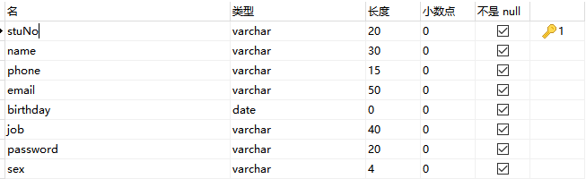

message表：

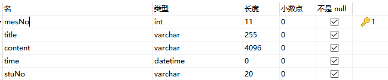

1.  **具体实现**

由于内容太多，此处仅以注册流程为例：

注册页面register.jsp

浏览器端界面（部分代码，具体请看附件）：

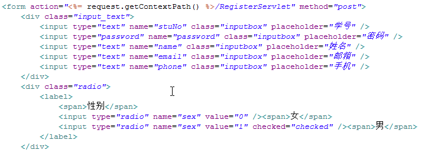

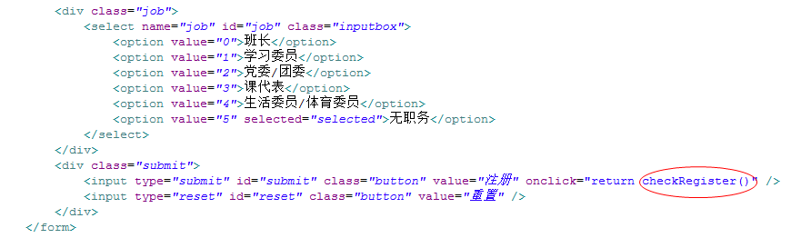

其中checkRegister()是一个JavaScript方法，用来验证用户输入是否合法，在浏览器端验证以节省用户时间，提高用户体验，其具体实现如下：

```javascript
/*验证学号密码是否输入正确*/
function checkRegister() {
	/*正则表达式*/
	var regStuNo = /^[1-9][0-9]{10}$/,
		regPasswd = /^[A-Za-z0-9\!\@\#\$\%\^\&\*\.\~]{6,22}$/,
		regName = /^([\u4e00-\u9fa5]{2,4}|([a-zA-Z]+\s?){1,30})$/,
		regEmail = /^([a-zA-Z0-9_\.\-])+\@(([a-zA-Z0-9\-])+\.)+([a-zA-Z0-9]{2,4})$/,
		regPhone = /^(0|86|17951)?(13[0-9]|15[012356789]|17[678]|18[0-9]|14[57])[0-9]{8}$/;
	/*按name获取元素*/
	var stuNo = document.getElementsByName("stuNo")[0],
		passwd = document.getElementsByName("passwd")[0],
		name = document.getElementsByName("name")[0],
		email = document.getElementsByName("email")[0],
		phone = document.getElementsByName("phone")[0],
		sex = document.getElementsByName("sex"),
		birthday_year = document.getElementById("year"),
		birthday_month = document.getElementById("month"),
		birthday_day = document.getElementById("day"),
		job = document.getElementsByName("job");

	if(!regStuNo.test(stuNo.value)){
		alert("学号为首位不为0的11位的数字");
		stuNo.focus();
		return false;
	}
	if(!regPasswd.test(passwd.value)){
		alert("密码为6~22位的数字英文字母或符号");
		passwd.focus();
		return false;
	}
	if(!regName.test(name.value)){
		alert("姓名为2~4个汉字或1~30个英文字母");
		name.focus();
		return false;
	}
	if(!regEmail.test(email.value)){
		alert("邮箱填写错误");
		email.focus();
		return false;
	}
	if(!regPhone.test(phone.value)){
		alert("手机号码填写错误");
		phone.focus();
		return false;
	}
	if(birthday_year.value==0 || birthday_month==0 || birthday_day==0){
		alert("生日没有填写");
		return false;
	}
	return true;
}
```

checkRegister()中使用正则表达式来验证输入的合法性

RegisterServlet

注册逻辑处理，检查用户是否存在，用户已存在不能注册，用户不存在可以注册

获取request数据

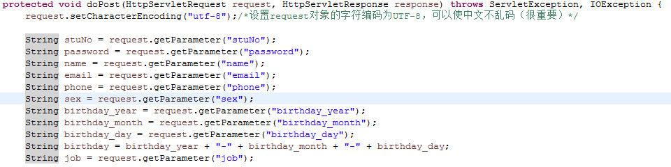

再次表单验证，增强安全性，防止恶意用户提交恶意代码

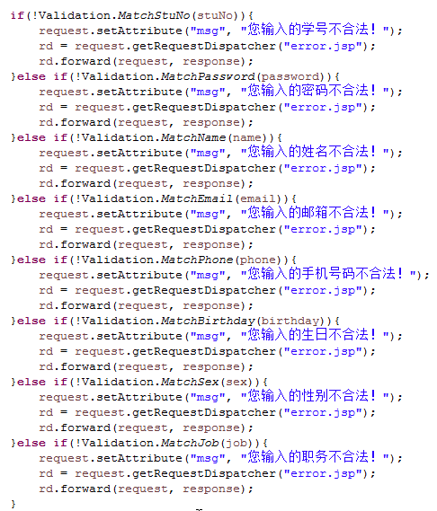

具体验证代码如下（部分，详细请查看附件）：

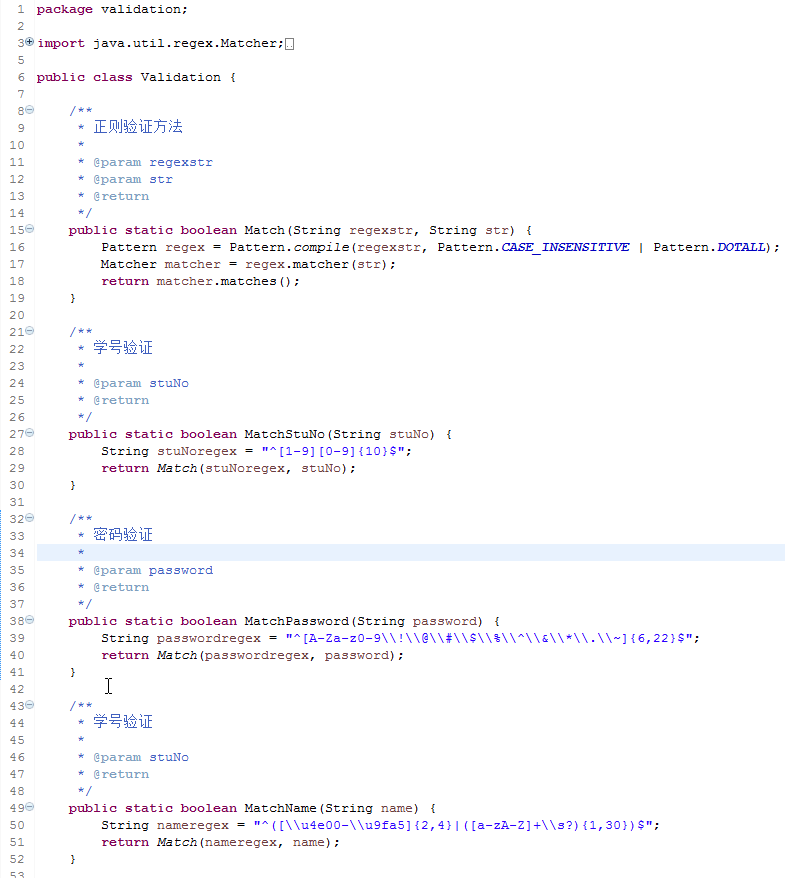

验证通过，将表单信息存储到一个User类中，直接传输这个User类。

然后验证用户的学号是否已被注册，防止重复注册，最后调用AddUserService类中的add方法，将user对象存入数据库

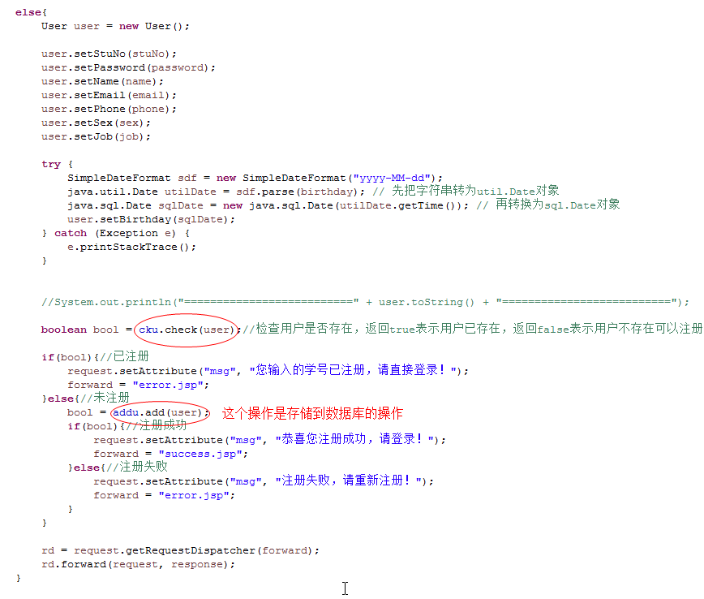

这是调用存储操作代码

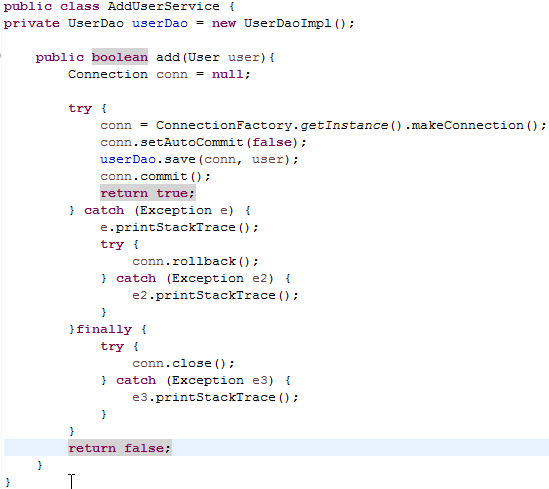

读取数据库配置信息，数据库配置文件为dbconfig.properties

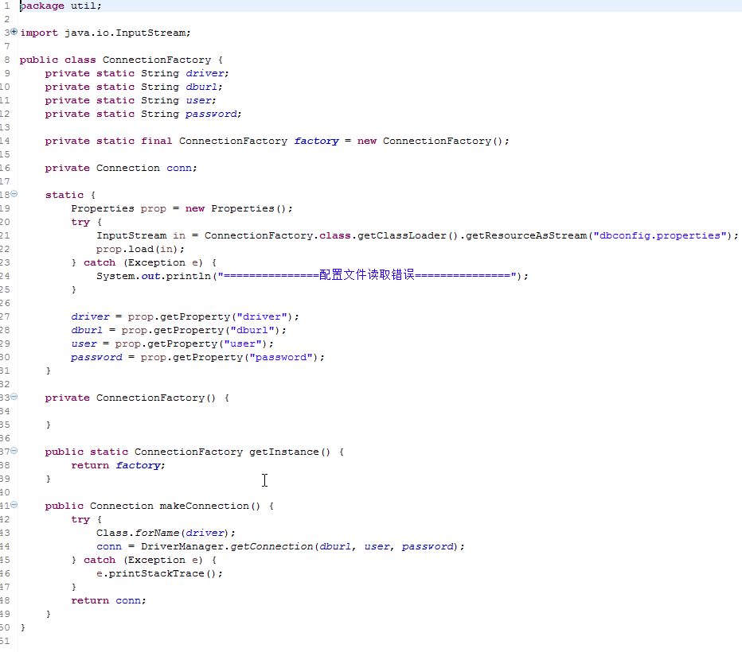

1.  **基本操作说明**

1.打开数据库，使用telnet localhost 3306命令查看是否成功打开端口，同时在任务管理器中查看mysqld是否正在运行，以及服务MySQL是否正在运行

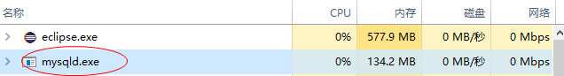


数据库建表语句见附件Publish.sql

2.打开Eclipse配置tomcat服务器

点击菜单栏Preferences &gt; Server &gt; Runtime Environments

然后点击Add添加tomcat服务器，点击OK配置成功

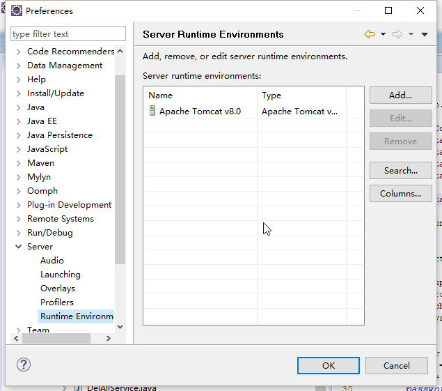

3.导入我附件中的War文件

4.在工程名鼠标右键单击选择Run As &gt; Run On Server使该工程运行在tomcat中，查看console是否有异常信息。有异常信息则需要进行排查后再进入下一步。

5.在浏览器端输入[*http://localhost:8080/Publish*](http://localhost:8080/Publish)进入工程初始页面

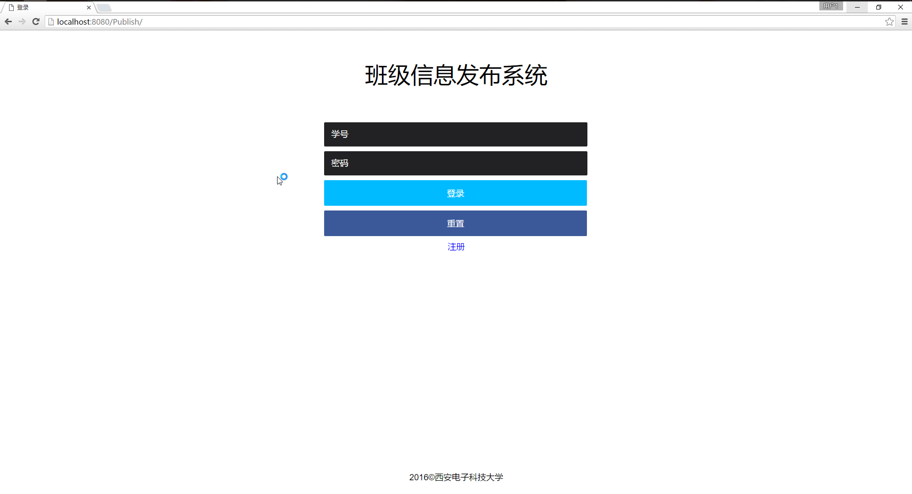

6.点击注册跳转到注册页面

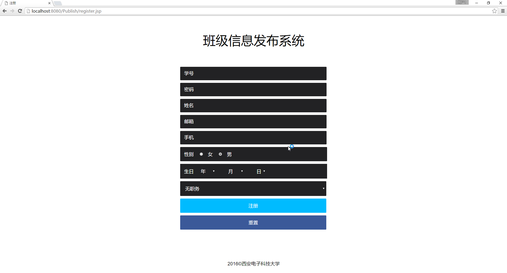

7.填写合法的用户信息

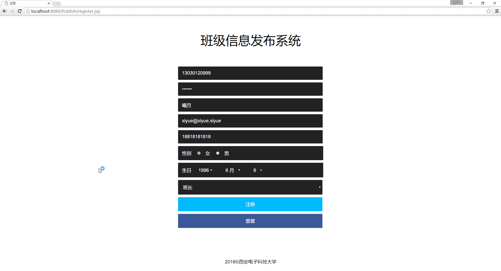

8.点击注册按钮，提交表单信息

9.提示注册成功

10.进入登录页面，填写学号和密码点击登录

11.跳转到主页

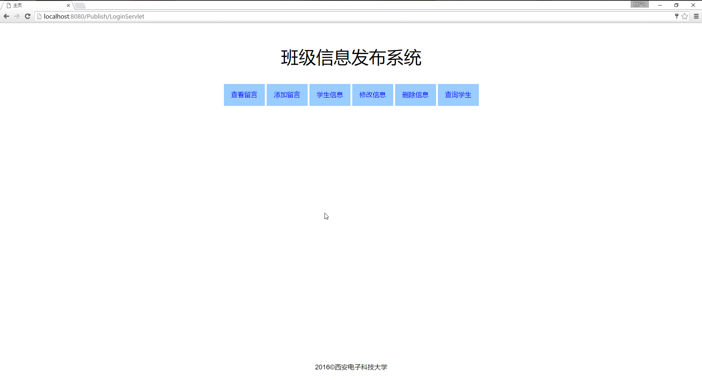

12.点击查看留言

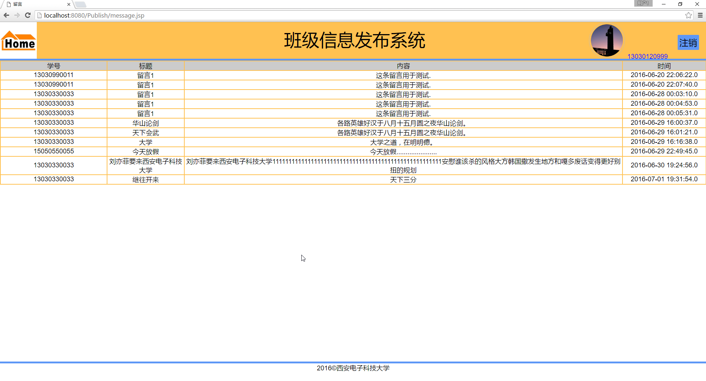

13.点击Home返回主页，点击添加留言

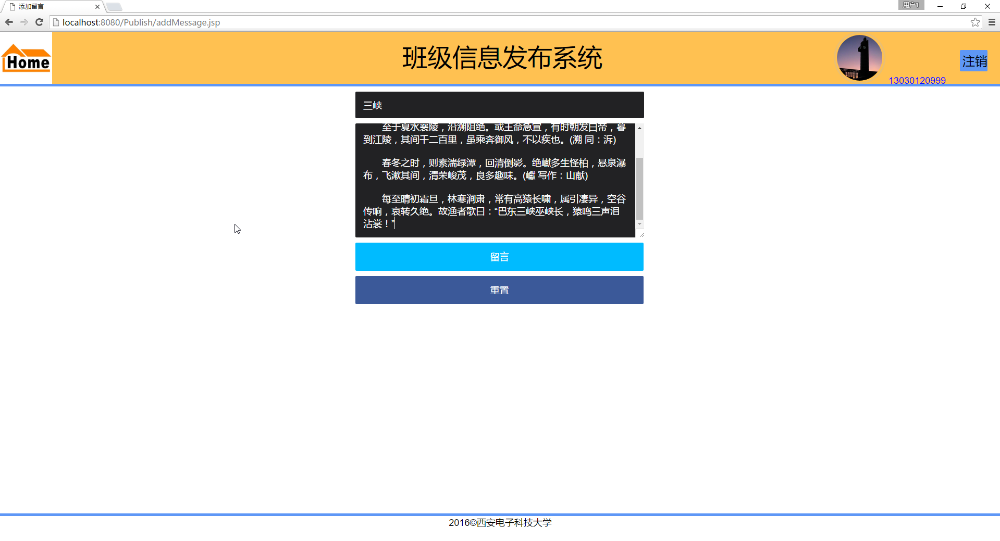

14.同学信息界面

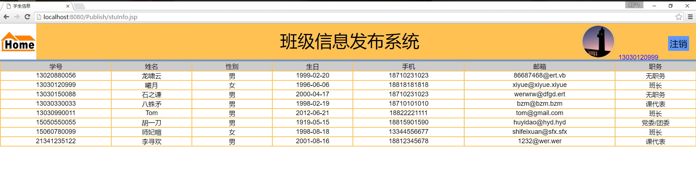

15.修改信息界面

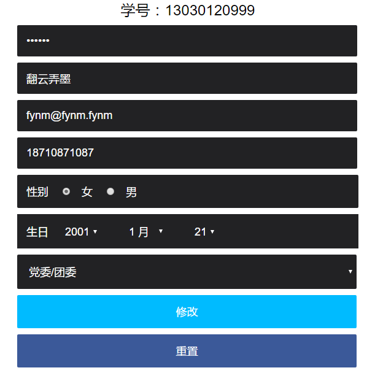

点击提交后查看效果

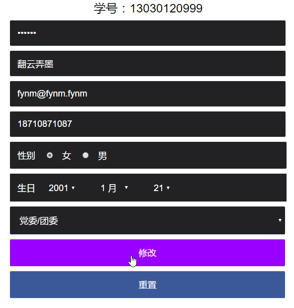

可以看到信息已被成功修改

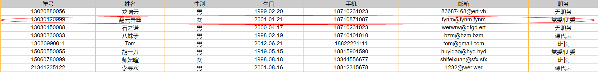

16.删除信息界面

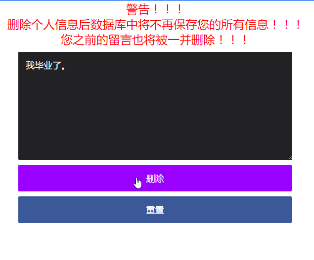

17.1按学号查询同学

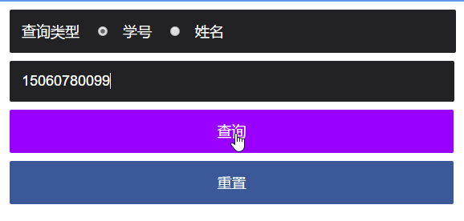

查询结果

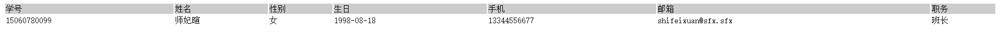

17.2按姓名查询同学

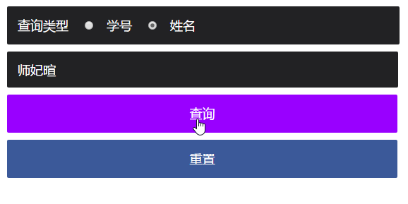

查询结果

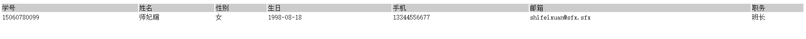

至此演示完毕。

1.  **总结**

> 本次JavaWeb工程实现班级留言系统让我深有感触。
>
> 首先，发现只有书本上的知识还不足以完成一个完整的功能完备的项目，还需要自学。比如说正则表达式的使用就是课堂上不会讲到的，需要自学。
>
> 其次，不动手你永远不知道事情有多难多简单，重要的是实践。课堂上对HTML、CSS以及JavaScript只占了一章的内容，而实际上我写这些却花了整个工程60%的时间。深入研究才发现这些知识其实也很多。
>
> 最后，要善于使用搜索引擎。许多知识都可以在搜索引擎上查到。
>
> 总之，这次作业是我提高了很多。

**附录**

1.  附件说明：

> WEB工程文件：Publish.war
>
> 数据库建表语句：Publish.sql
>
> 工程源码打包：Publish.zip
